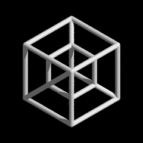

# Tesseract (TSR)

[Tesseract](https://github.com/cryptotechguru/tesseract) a new blockchain forked from OCEAN (which was forked from Equibit which was forked from Bitcoin).

The codebase is forked from [Bitcoin 0.16.3](https://github.com/bitcoin/bitcoin/releases/tag/v0.16.3). Like Equibit this blockchain has a different genesis block which makes it an alt-coin rather than a hard fork of bitcoin like [BCH](https://www.bitcoincash.org/) and [BSV](https://bitcoinsv.io/).

Besides the rebranding, Tesseract implemented some major modifications to Bitcoin:
* The block subsidy follows a sinusoidal (sigmoidal) curve rather than exponential decay (halving)
* The difficulty re-targeting algorithm was replace with [Dark Gravity Wave](https://coinguides.org/dark-gravity-wave/)
* SHA-256 hash was replaced by [SHA-3](https://en.wikipedia.org/wiki/SHA-3)
* A pre-mine of 1 million coins yielding a cap of exactly 21 million coins total

## SHA-3

Some other coins such as [Maxcoin](https://maxcoinproject.org/) claim to implement SHA-3 but they actually use the Keccak-256 hash which is not identical. Keccak was chosen as the official successor for SHA-256 after being a finalist and finally winning a 5 year long international competition run by the National Institute of Standards and Technology (NIST) but there was a [minor change](https://crypto.stackexchange.com/questions/15727/what-are-the-key-differences-between-the-draft-sha-3-standard-and-the-keccak-sub) made to the draft standard. The upshot is that miners that support Keccak will not work for SHA-3. Currently only the [bfgminer](https://github.com/project-ocean/bfgminer-sha3) adapted for SHA-3 can be uesd to mine blocks.

Almost everywhere SHA-256 hashing was used was replaced by SHA-3: 
* block hash
* transaction ID
* script hashing
* `OP_HASH160` and `OP_HASH256` op codes
* Merkle trees
* network message checksum
* signature cache
* RPC auth
* segwit (witness root)

There are two exceptions to the rule for backwards compatibility:
* Base58Check (legacy address format)
* TOR protocol checksum (external standard)

## Stats Site

Alpha-tester Jorgeminator contributed a mod that integrates [Jameson Lopp](https://twitter.com/lopp)'s [statoshi](https://statoshi.info/) mods. 
The public [Grafana](http://stats.tesseract-crypto.io/) site uses these mods to generate essential blockchain stats in a very readable format:

# Futures

## Block Explorer

TBD

## Wallet

The core node software inherits a fully functional wallet that is accessible via the command line and RPC calls.
To gain wider adoption we will need a GUI wallet, or to integrate with existing GUI wallets.
 
##  Difficulty Control System

It may be possible to improve on the Dark Gravity Wave difficulty re-targeting algorithm by applying control system theory, specifically a discrete [PID](https://en.wikipedia.org/wiki/PID_controller) controller calibrated to optimize dynamic response metrics.

## Securities

Tesseract is intended to be an equity blockchain, enabling this issuance and distributed trading of security tokens.
Recognizing that the mainstream financial securities industry will take some time before a blockchain is trusted with corporate financial instruments we believe it will be essential to demonstrate real use cases in other domains.
The [Meridion](https://cryptotechguru.github.io/Cryptonomicon/Projects/Meridion.html) governance system provides a salient example by issuing shares in projects rather than companies.
Once the basic API for issuing and trading shares is in place it will be feasible to expand into other kinds of non-fungible tokens.
